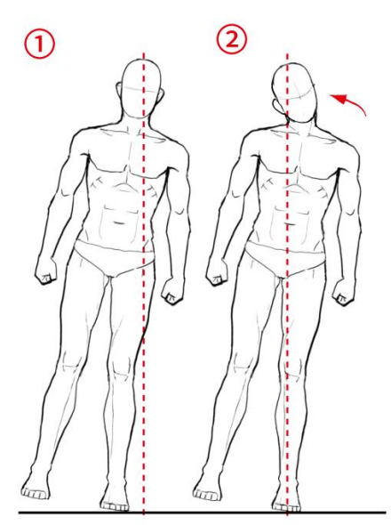
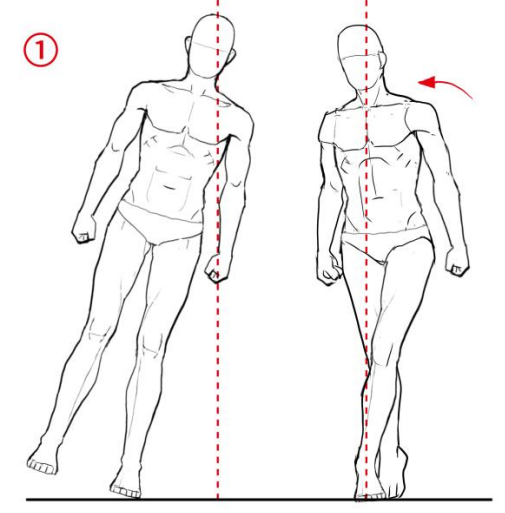

---
---

# 人物姿势的定理 - ポーズの定理 第 1 章

## 平衡恢复反应

`平衡恢复反应（立ち直り反応）`：人体在失去平衡之后，为了恢复平衡而作的一系列动作。

:::info 补充
人无时无刻都受到重力的影响。**绘画过程中需要加入重力的思考**。

失衡的原因也是重力，具体原因是人体的**重心偏移**。
:::

### 头部的反应

头部的重心集中在**后脑**。为了保持平衡，头部会向与重心偏移**相反**的方向倾斜。

头部偏移方向的肩会更高。

:::info 补充
人在捡地上的东西时，头朝下，可以达到快速弯腰的效果。而头朝上则可以恢复到站立姿态。
:::

### 股关节的反应

重心偏移导致某一只脚会变为**承重脚**，由于股关节周围的**臀中肌**在受到刺激时会**难以弯曲**，所以承重脚一侧的腰会比另一侧更高。

### 腰椎的反应

A 型：

B 型：

C 型：

### 腕的反应
